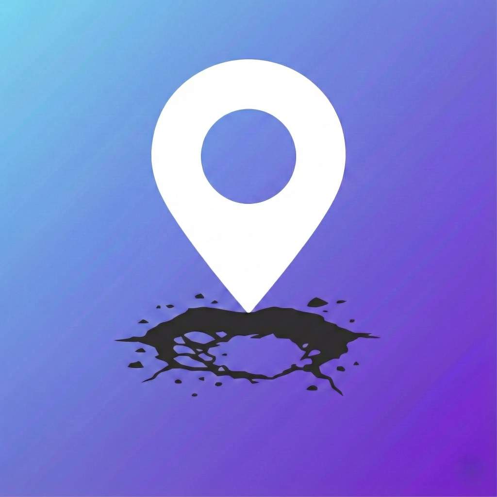

# 🛣️ RoadGuard AI

<p align="center">
  
</p>

> **AI-powered pothole detection system for safer roads**

🔗 **[Live Demo](https://roadguardai.vercel.app/)** | 📦 [GitHub](https://github.com/dsnp555/Road_Guard-AI)

RoadGuard AI is a real-time road hazard detection application that uses YOLOv8 machine learning to automatically identify potholes and road damage. Built with React, TypeScript, and ONNX Runtime for browser-based inference.

    

---

## ✨ Features

### 🎥 Live Detection Mode
- **Real-time pothole detection** using your device camera
- YOLOv8 model runs **locally in the browser** (no server required)
- Detection every **1 second** with bounding box overlays
- **Automatic report submission** when potholes are detected
- Smart duplicate detection to prevent spam reports

### 📸 Snap & Report Mode
- Manually upload photos of road hazards
- AI analyzes images and draws detection boxes
- Attach GPS location automatically
- Submit reports with severity classification

### 👤 User Dashboard
- View your submitted reports
- Track report status (Pending → In Progress → Completed)
- Cancel pending reports
- Quick access to Live and Manual detection modes

### 🏛️ Admin Dashboard
- View all reports from all users
- Filter by status: ALL | PENDING | IN PROGRESS | COMPLETED | CANCELLED
- Update report status
- View detailed evidence with AI analysis
- Direct links to Google Maps locations

---

## 🚀 Tech Stack

| Technology | Purpose |
|------------|---------|
| **React 19** | Frontend framework |
| **TypeScript** | Type-safe development |
| **Vite** | Fast build tool |
| **YOLOv8** | Pothole detection model |
| **ONNX Runtime Web** | Browser-based ML inference |
| **Supabase** | Authentication & database |
| **TailwindCSS** | Styling |

---

## 🛠️ Installation

### Prerequisites
- Node.js 18+ 
- npm or yarn
- Supabase account (for database)

### Setup

1. **Clone the repository**
   ```bash
   git clone https://github.com/dsnp555/Road_Guard-AI.git
   cd Road_Guard-AI
   ```

2. **Install dependencies**
   ```bash
   npm install
   ```

3. **Configure environment**
   Create a `.env` file with your Supabase credentials:
   ```env
   VITE_SUPABASE_URL=your_supabase_url
   VITE_SUPABASE_ANON_KEY=your_anon_key
   ```

4. **Run development server**
   ```bash
   npm run dev
   ```

5. **Open in browser**
   Navigate to `http://localhost:3000`

---

## 📁 Project Structure

```
roadguard-ai/
├── public/
│   └── models/
│       └── yolov8n-pothole.onnx    # YOLOv8 detection model (13MB)
├── services/
│   ├── yoloService.ts              # YOLO model loading & inference
│   ├── storageService.ts           # Supabase database operations
│   ├── geminiService.ts            # (Legacy) Gemini AI service
│   └── supabaseClient.ts           # Supabase client config
├── views/
│   ├── LiveDetector.tsx            # Real-time camera detection
│   ├── ManualReporter.tsx          # Manual photo upload
│   ├── UserDashboard.tsx           # User report management
│   └── AdminDashboard.tsx          # Admin control panel
├── components/
│   ├── Button.tsx
│   ├── Modal.tsx
│   └── LoginView.tsx
├── App.tsx                         # Main application
├── types.ts                        # TypeScript interfaces
└── index.html
```

---

## 🔧 Configuration

### Supabase Database Schema

Create a `reports` table with the following columns:

| Column | Type | Description |
|--------|------|-------------|
| id | text | Primary key |
| user_id | text | User identifier |
| image_url | text | Uploaded image URL |
| latitude | float8 | GPS latitude |
| longitude | float8 | GPS longitude |
| status | text | pending/in_progress/completed/cancelled |
| timestamp | int8 | Unix timestamp |
| severity | text | low/medium/high |
| description | text | AI-generated description |
| is_auto_detected | bool | True if from Live Detection |

### RLS Policies Required

```sql
-- Allow users to view all reports
CREATE POLICY "Public reports are viewable by everyone" ON reports FOR SELECT USING (true);

-- Allow users to insert reports
CREATE POLICY "Users can insert their own reports" ON reports FOR INSERT WITH CHECK (true);

-- Allow admins to update reports
CREATE POLICY "Admins can update reports" ON reports FOR UPDATE USING (true);

-- Allow users to delete reports
CREATE POLICY "Users can delete their own reports" ON reports FOR DELETE USING (true);
```

---

## 🧠 How YOLO Detection Works

1. **Model Loading**: The YOLOv8 ONNX model (13MB) loads in the browser using ONNX Runtime Web
2. **Frame Capture**: Camera frames are captured every 1 second
3. **Preprocessing**: Images are resized to 640x640 and normalized
4. **Inference**: Model runs locally using WebAssembly
5. **Post-processing**: Non-Maximum Suppression (NMS) filters overlapping detections
6. **Result**: Bounding boxes with confidence scores and severity classification

### Severity Mapping
- **High**: Confidence ≥ 70%
- **Medium**: Confidence 50-70%
- **Low**: Confidence < 50%

---

## 📱 Usage

### For Users
1. Sign up or log in
2. Choose **Live Detection** (mount phone while driving) or **Snap & Report** (take a photo)
3. Allow camera and location permissions
4. Detected potholes are automatically reported with GPS coordinates

### For Admins
1. Log in with admin credentials
2. View all incoming reports
3. Update status as repairs progress
4. Filter by status to prioritize work

---

## 🌐 Deployment

### Vercel (Recommended)
1. Push to GitHub
2. Import project in [Vercel](https://vercel.com)
3. Add environment variables
4. Deploy!

### Build for Production
```bash
npm run build
npm run preview
```

---

## 📄 License

MIT License - feel free to use this project for your own purposes.

---

## 🤝 Contributing

Contributions are welcome! Please feel free to submit a Pull Request.

---

## 📞 Support

For issues or questions, please open a GitHub issue.

---

**Made with ❤️ for safer roads**